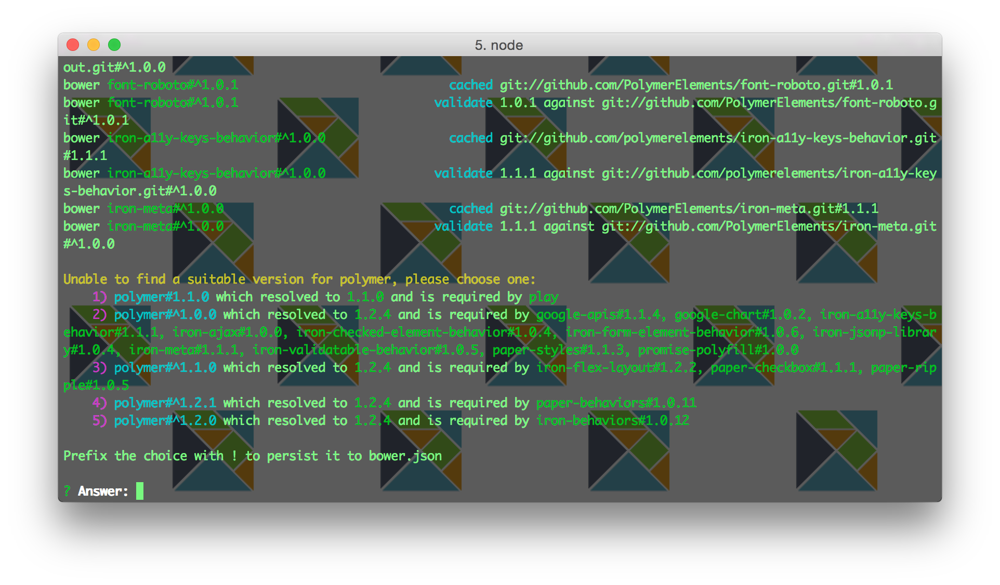

## Setting up a new Elm project to use Polymer 

The steps for using Polymer components in an Elm app are:

* ##### Initialize project to use bower

        bower init

* ##### Install Polymer dependencies via bower

        bower install --save Polymer/polymer

* ##### Install the Polymer component(s) of interest, like so

        bower install --save Polymer/paper-checkbox

* ##### Install the elm-html package

	    elm-package install evancz/elm-html

* ##### Actually use a Polymer component in your Elm file
  
  Polymer components are HTML5 custom tags, so you can use elm-html's node function to generate them, like so:

      .
      .
      .
      node "paper-checkbox" [ checked False ] []
      .
      .
      .
* ##### Include Polymer JavaScript and HTML files

	Your main HTML file should look something like below; for instance, if you want the paper-checkbox component, you'd have the following includes:

		
		<link rel="import" href="../bower_components/polymer/polymer.html">
		<link rel="import" href="../bower_components/paper-checkbox/paper-checkbox.html">

* ##### Include transpiled JavaScript

  In this example, the name of the transpiled file is Polymer.js and it is rendered fullscreen in the browser:

      .
      .
      .
      
      
      .
      .
      .

## How to just get this example running

If you just want to run the example HTML file, do the following:

* ##### Clone this repo

        git clone https://github.com/quephird/polymer-with-elm
      
  ... and move into the new directory.

* ##### Run Bower to get dependencies

  You need to have Bower first, which in turn requires node.js and NPM. See the directions on obtaining both [here](https://nodejs.org/download/) and [here](http://bower.io/#install-bower)
  
  Once you have them, run this from within the project directory:
  
      bower install

  UPDATE: The libraries have evolved quite a bit since I last worked on this project and I haven't kept up with the Elm nor Polymer ecosystems. As of this writing (20160208) you will be presented with a set of choices for which version of the
  polymer dependency you would like:
  
  

  Choose 1 and continue.

* ##### Run elm-reactor

  Run the following:

      elm-reactor

  You should see something like this:
  
	  danielles-MacBook-Pro:polymer-with-elm danielle$ elm-reactor
	  Elm Reactor 0.3.2 (Elm Platform 0.15.1)
	  Listening on http://0.0.0.0:8000/

* ##### Point your browser to localhost

  Now you're finally ready to run the example; simply point your browser [http://localhost:8000](http://localhost:8000) and you should see a directory listing. Doubleclick on the src directory, then Polymer, then ChartDemo.elm. That should trigger compilation of all Elm files needed for the demo. (You could of course just run the following command to accomplish the same:)
  
	  elm-make ./src/Polymer/ChartDemo.elm
	  
  Go back to the main menu and doubleclick on ChartDemo.html, and voilá you should see a bunch of charts.
  